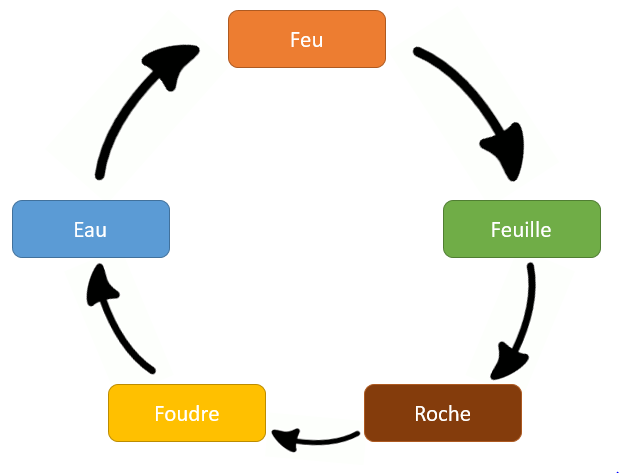

# MCR Projet
Projet dans le cadre du cours de *Modèles de conception réutilisables (MCR)*, qui met en oeuvre le patron de conception **Décorateur**.

## Cahier des charges
### Description du jeu
Le projet est un jeu de rôle en ligne de commandes avec un système de tour par tour. Le joueur peut mixer des éléments pour créer des sorts
puissants face aux monstres auxquels il est confronté. Les monstres peuvent porter des armures imprégnées de magies résistantes à certains
types de sorts, ce qui demandera au joueur un sens de stratégie pour avancer dans le jeu.
Le but du jeu est de monter le plus possible de niveaux, d'améliorer ses sorts et de vaincre le plus possible de monstres.

### Progression du joueur
Le joueur gagne de l'expérience à chaque monstre vaincu. Le montant de points d'expérience gagné varie selon les monstres vaincus, par leur
type et leur propre niveau, qui s'adapte selon le niveau du joueur.

### Sorts du joueur
Les sorts du joueur sont des combinaisons de 1, 2 ou 3 éléments.
#### Éléments

- **Feu**: Bat la feuille, mais faible contre l'eau
- **Eau**: Bat le feu, mais faible contre la foudre
- **Foudre**: Bat l'eau, mais faible contre la roche
- **Roche**: Bat la foudre, mais faible contre la feuille
- **Feuille**: Bat la roche, mais faible contre le feu
- **Bouclier**: Doit être combiné avec au moins un autre élément pour protéger le joueur d'une prochaine attaque.

## Annexes
[Présentation sur Decorator pattern](https://docs.google.com/presentation/d/1ut6Z_v5dZSnAWxiVnd7M8C_0UY7l7T_Adyf9Ep0WFmM/edit?usp=sharing)

[Rapport d'implémentation](https://docs.google.com/document/d/1W6f9Hr3Z06GwksQjO3yI6CN40MF6-ozX6gCRqe9kRsM/edit)
